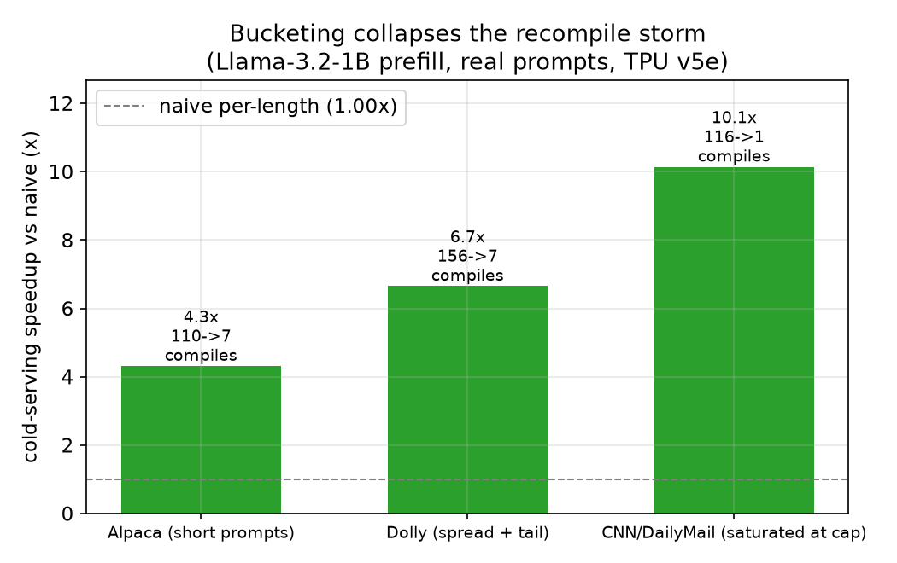
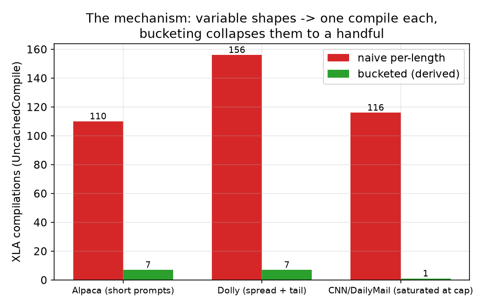
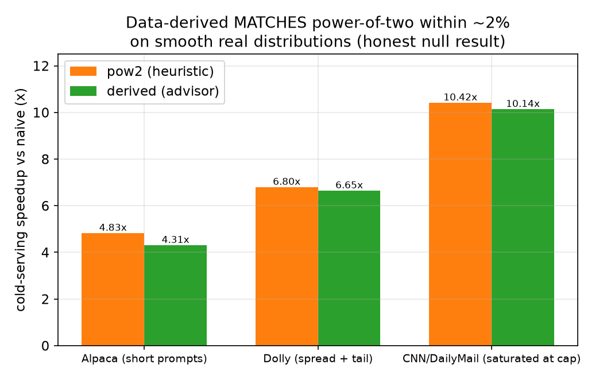
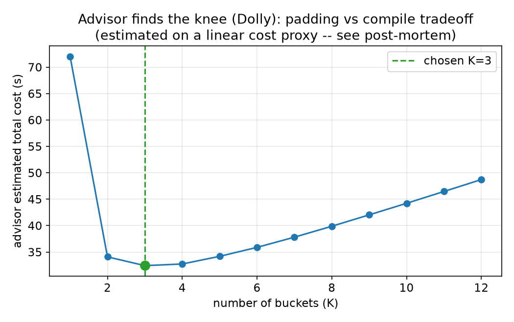

# Data-Derived Sequence Bucketing on a TPU — a measured study

**A measured study of XLA recompilation on a real TPU — including the part where
my own hypothesis didn't survive contact with the data.**

*(Prefer a rendered version? Open [`report.html`](report.html) in a browser.)*

---

**Short version:** on a real TPU, collapsing the recompile storm with bucketing is
a **4–10× win** for variable-length LLM prefill — measured up to **156
compilations dropping to 7**. **Longer, more honest version:** I hypothesized that
*data-derived* buckets would beat the power-of-two heuristic. Across three real
prompt distributions they **matched it within ~2%** rather than beating it — and
*why* is the more interesting result.

*Hardware: Kaggle TPU v5e. Model: Llama-3.2-1B-Instruct, prefill, bf16, batch 1.
Source of truth: [`../results/measured_tpu.json`](../results/measured_tpu.json);
charts regenerate via `uv run python scripts/render_report.py`. Reproduce:
[`../notebooks/llm_serving_tpu.ipynb`](../notebooks/llm_serving_tpu.ipynb).*

## 1. The question

XLA recompiles whenever an input shape changes. For LLM serving, every distinct
prompt length is a distinct shape, so a stream of variable-length prompts pays a
**recompile storm**. The standard fix is *bucketing*: pad each prompt up to one of
a small set of sizes so only those few shapes reach the compiler — exactly the
**bounded dynamism** problem on TorchTPU's roadmap.

The open question is **which buckets**. Powers of two are the default reflex but a
guess, blind to the workload. My thesis: derive the bucket set (and count) from
the empirical length distribution + the measured compile cost, with an optimizer
minimizing real wall-time.

## 2. What I built

A bucket advisor (pure, CPU-testable) + a serving benchmark:

1. **Fit a compute cost model.** Measure prefill time at a sweep of lengths, fit
   `t(len) ≈ a·len + b·len²` by least squares.
2. **Measure the per-compile cost** empirically (cold − warm).
3. **Contiguous-partition DP** over sorted unique lengths picks K caps minimizing
   `Σ countᵢ·cost(cap(i))` — the padded compute bill.
4. **Sweep K**, add `K · compile_cost`, choose K at the knee of the cost curve.

The benchmark serves a stream of real prompt lengths three ways — `exact`,
`pow2`, `derived` — and measures wall-time + compilations on the live TPU.

## 3. How I measured it

- **Real TPU.** Kaggle v5e, Llama-3.2-1B, prefill, batch 1, bf16; lazy execution
  synced before the timer stops.
- **Real distributions.** Lengths tokenized from three datasets (only the length
  distribution is used — prefill cost is a function of shape, not token values).
- **Cold vs warm, separated.** Headline is the *cold* pass (each distinct shape
  pays its compile once — the real cold/diverse-serving cost). Warm steady-state
  reported as mean ± std over 3 hot-cache passes, never conflated.
- **Compile count** from `UncachedCompile` (not `CompileTime`, a time metric).
- **Padding correctness is tested:** with a causal mask, last-real-token logits
  are identical (bf16 tolerance) padded vs unpadded.

## 4. The real win — bucketing at all

| Dataset (regime) | naive | `pow2` | `derived` | compiles (naive→derived) |
|------------------|------:|-------:|----------:|-------------------------:|
| Alpaca (short)   | 1.00× | 4.83×  | 4.31×     | 110 → 7 |
| Dolly (spread + tail) | 1.00× | 6.80× | 6.65× | 156 → 7 |
| CNN/DM (saturated) | 1.00× | 10.42× | 10.14×  | 116 → 1 |





## 5. The honest twist — my hypothesis didn't win

I expected `derived` to beat `pow2`. It didn't. Across all three real
distributions, **data-derived matched the heuristic within ~2%** (pow2 marginally
ahead each time).



I did **not** keep swapping datasets until one flattered the thesis — that's
p-hacking. Three real distributions is a robust answer: **for smooth real LLM
prompt lengths, which sensible bucket scheme you pick barely matters; bucketing at
all is what counts.**

### Why derived loses — a cost-model post-mortem

Not a bug, and informative. On Dolly, `derived` takes **fewer compiles (7 vs 9)**
but **more padding (1.30× vs 1.21×)**. The fitted cost model comes out *linear*
every run (`b ≈ 0` at these lengths), so it under-penalizes padding and the DP
over-trades padding for compiles. pow2's tighter packing saves more compute than
its two extra compiles cost → it wins by ~2%. A padded-token-weighted (quadratic)
cost would close the gap; even then the advisor *matches* pow2 on smooth
distributions, not beats it.



The advisor does find a real knee (K=3 on Dolly); the residual gap is cost-proxy
error, not a missing optimum.

## 6. Where data-derived would earn its keep

The advisor's value isn't winning a benchmark — it's **deriving the bucket set and
count automatically** instead of relying on the pow2 grid happening to fit, and
telling you when you *don't* need it (CNN/DM saturates the cap → it correctly
picks K=1). It would diverge from pow2 on distributions with dense clusters just
*above* a power of two (where pow2 over-pads) — a falsifiable prediction the cost
model makes.

## 7. Relevance to TorchTPU

Recompilation is the documented cliff for dynamic PyTorch/XLA workloads; bounded
dynamism is the roadmap answer. This is a small, concrete, *measured* instance: it
quantifies the cliff on a real TPU (156 → 7 compiles, ~6.7×), shows a simple
heuristic already captures most of the bounded-dynamism win, and is honest about
the limits of a learned bucket optimizer. Advisor, DP, cost-fit, and
padding-correctness all run/test on CPU; only the headline needs the TPU.

## 8. Reproduce

```bash
# CPU: advisor, DP, cost-fit, padding-correctness — testable without a TPU
uv run pytest
uv run python -m benchmarks.llm_prefill_serving --dry-run

# TPU (Colab or Kaggle): run notebooks/llm_serving_tpu.ipynb top to bottom,
# switching DATASET in {alpaca, dolly, cnn}; then update results/measured_tpu.json
uv run python scripts/render_report.py   # regenerate the charts
```
